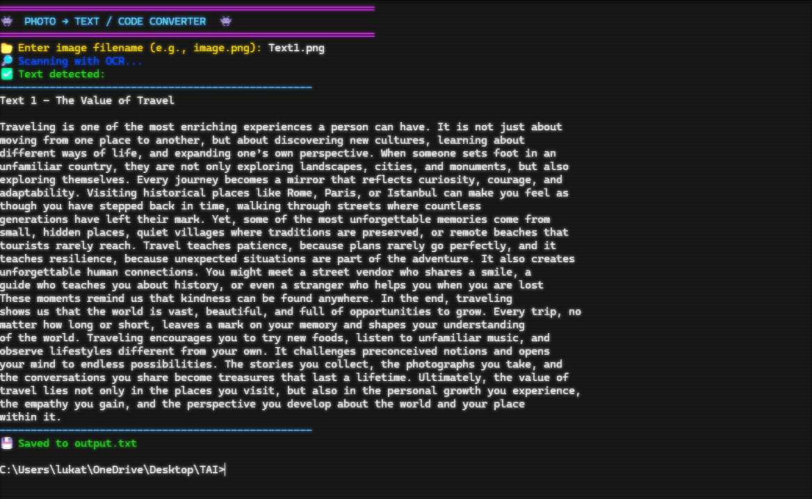
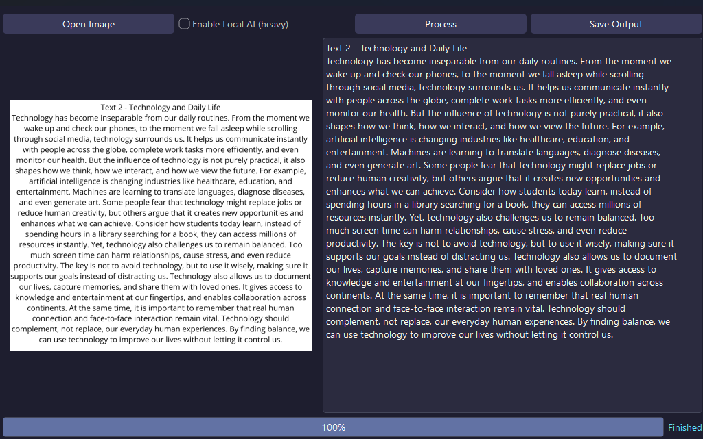
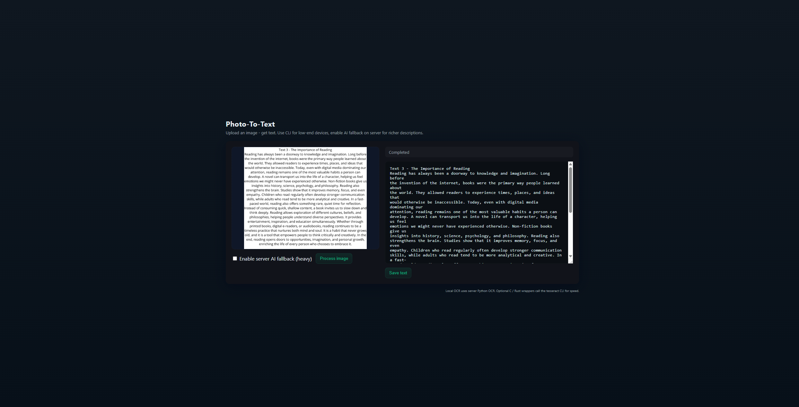

# 👾 Photo-To-Text

Photo-To-Text is a **powerful OCR and AI-powered image-to-text converter**.  
It allows users to extract text from images using **Tesseract OCR**, and if OCR fails, it can automatically generate descriptive text using a local **BLIP AI model**.  

The project comes in **two flavors**:  

- **Desktop GUI & CLI** using **Python (PyQt6)** for offline use and heavy AI processing.  
- **Web application** with a **modern dark frontend** and backend in **Node.js + Python** for easy access through browsers.  

---

## ScreenShots

## ⚡ Features

- Extract text from any image quickly using **OCR**.  
- Automatically describe images using **local BLIP AI** when OCR fails.  
- CLI for lightweight systems and full GUI for better user experience.  
- Dark-themed **modern interface** for web and desktop.  
- Fast, optimized backend for web (Python + Node.js) with optional AI acceleration.  
- Fully portable **BLIP model cache** for offline use.  

---

## 🖥 Desktop Version (GUI & CLI)

The desktop version is designed for **powerful computers**, using local BLIP AI for better accuracy.

### Requirements

- Python 3.10+
- PyQt6
- Pillow
- pytesseract
- torch, transformers (optional for AI)
- Tesseract OCR installed and configured

### Setup

1. Clone the repository:

git clone https://github.com/Luka12-dev/Photo-To-Text.git
cd Photo-To-Text
Install Python dependencies:

python -m pip install -r requirements.txt
Download the BLIP AI model:

setup_blip_model.bat
This batch file automatically installs required packages and downloads the BLIP model into the blip_model folder.

---

## Application (GUI / CLI)

Run the application:

python Photo-To-Text.py   # GUI
python Photo-To-Text-CLI.py  # CLI

---

## WEB 
🌐 Web Version
The web version is optimized for cross-platform access. It uses a Node.js backend and a Python OCR script.

Features
Upload images through browser.

Get OCR or AI-generated text instantly.

Optional local AI processing.

Dark modern UI with responsive layout.

Small footprint: backend delegates OCR to Python for speed.

Setup
Navigate to the backend folder:

cd backend/node
Install Node.js dependencies:

npm install express multer cors
Start the server:

---

# Run server
node server.js
Open the web app in a browser:

http://localhost:3000
Screenshots
Web Dashboard

Processing an Image

---

## 📂 File Structure

Photo-To-Text/
│
├─ python/
│   ├─ Photo-To-Text-CLI.py
│   └─ Photo-To-Text-GUI.py
├─ frontend/          # Web frontend
│   ├─ index.html
│   ├─ styles.css
│   └─ main.js
├─ backend/node/
│   ├─ server.js
│   └─ uploads/
├─ blip_model/ # When you load it (after first use)
├─ ScreenShots/
└─ README.md

---

## 📝 Notes & Tips
Desktop GUI is recommended for machines with good CPU/GPU, as the AI model can be heavy.

CLI version is lightweight and works on minimal hardware.

Web version allows access from any device with a browser.

BLIP AI improves text extraction up to 70-90% on images without explicit text, but achieves 100% on images containing actual text.

You can customize themes in PyQt6 GUI via apply_theme class (QSS style).

---

🏆 Credits
Developed by Luka
